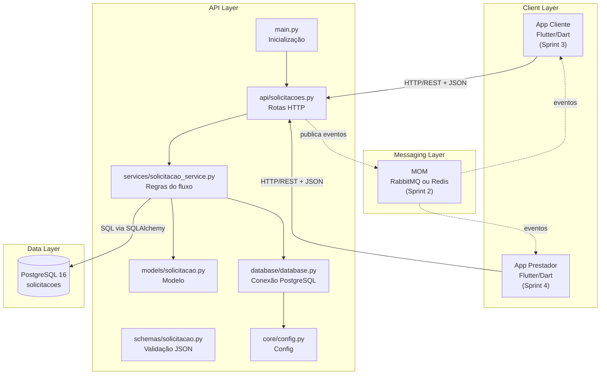

# Arquitetura do Sistema — ForgeDesk

## Visão Geral

O ForgeDesk é uma plataforma para contratação de serviços criativos voltados a projetos independentes.  
O sistema permite que clientes publiquem solicitações com briefing, prazo, orçamento e referências, enquanto prestadores criativos visualizam oportunidades disponíveis, aceitam demandas e atualizam o andamento do serviço.

Na Sprint 1, a implementação contempla o backend REST, a persistência em PostgreSQL, o schema documentado e a coleção de testes no Postman. Os aplicativos móveis e a comunicação assíncrona por MOM fazem parte da arquitetura planejada para as próximas sprints.

---

## Arquitetura Geral



---

## Componentes do Sistema

| Componente | Tecnologia | Responsabilidade |
|---|---|---|
| App Cliente | Flutter / Dart | Permitir que clientes criem solicitações criativas e acompanhem seus status |
| App Prestador | Flutter / Dart | Permitir que prestadores visualizem oportunidades, aceitem serviços e atualizem o andamento |
| ForgeDesk API | Flask / Python 3.13 | Expor endpoints REST, validar dados e controlar o fluxo das solicitações |
| Banco de Dados | PostgreSQL 16 | Armazenar solicitações, status, prazos, orçamentos e vínculos com prestadores |
| MOM | RabbitMQ ou Redis Pub/Sub | Distribuir eventos assíncronos nas próximas sprints |
| Postman | Collection JSON | Documentar e testar os endpoints da Sprint 1 |
| Docker Compose | Docker | Subir o PostgreSQL em ambiente local de desenvolvimento |

---

## Comunicação entre Componentes

| Origem | Destino | Comunicação | Formato |
|---|---|---|---|
| App Cliente | ForgeDesk API | HTTP/REST | JSON |
| App Prestador | ForgeDesk API | HTTP/REST | JSON |
| ForgeDesk API | PostgreSQL | Protocolo PostgreSQL | SQL via SQLAlchemy |
| ForgeDesk API | MOM | AMQP ou Redis Pub/Sub | JSON |
| MOM | App Prestador | WebSocket ou polling assíncrono | JSON |
| MOM | App Cliente | WebSocket ou polling assíncrono | JSON |

---

## Modelo de Dados — Sprint 1

A entidade central do sistema é a `solicitacao`.  
Ela representa uma demanda criativa publicada por um cliente, contendo as informações necessárias para que um prestador avalie e aceite o serviço.

### Tabela `solicitacoes`

| Coluna | Tipo | Restrição | Descrição |
|---|---|---|---|
| id | SERIAL | PK | Identificador único da solicitação |
| cliente_id | INTEGER | NOT NULL | Identificador do cliente responsável pela criação |
| prestador_id | INTEGER | NULL | Identificador do prestador que aceitou a solicitação |
| titulo | VARCHAR(120) | NOT NULL | Título curto da solicitação |
| descricao | TEXT | NOT NULL | Briefing detalhado do serviço criativo |
| tipo_servico | VARCHAR(80) | NOT NULL | Categoria do serviço solicitado |
| orcamento | FLOAT | NULL | Valor estimado pelo cliente |
| prazo | DATE | NULL | Data desejada para entrega |
| referencia | TEXT | NULL | Referência textual, link ou observação criativa |
| status | VARCHAR(30) | NOT NULL | Estado atual da solicitação |
| criado_em | TIMESTAMP | NOT NULL | Data de criação |
| atualizado_em | TIMESTAMP | NOT NULL | Data da última alteração |

---

## Categorias de Serviço Previstas

| Tipo de Serviço | Exemplos |
|---|---|
| Design | Capa, identidade visual, layout de material |
| Ilustração | Arte de personagem, avatar, concept art |
| Diagramação | PDF, zine, suplemento ou documento autoral |
| Revisão | Revisão textual e melhoria de escrita |
| Cartografia | Mapas fictícios, mapas de cenário ou mapas de jogo |
| Escrita | Lore, roteiro, descrição de mundo ou material narrativo |

---

## Estados da Solicitação

| Status | Significado |
|---|---|
| PENDENTE | Solicitação criada e ainda sem prestador |
| ACEITA | Solicitação aceita por um prestador |
| EM_ANDAMENTO | Serviço em execução |
| CONCLUIDA | Serviço finalizado |
| CANCELADA | Solicitação cancelada |
| RECUSADA | Solicitação recusada ou não assumida |

---

## Endpoints REST — Sprint 1

| Método | Rota | Descrição |
|---|---|---|
| GET | /health | Verifica se a API está disponível |
| POST | /solicitacoes | Cria uma nova solicitação criativa |
| GET | /solicitacoes | Lista as solicitações cadastradas |
| GET | /solicitacoes/{id} | Retorna os detalhes de uma solicitação |
| PATCH | /solicitacoes/{id}/status | Atualiza o status e pode associar um prestador |
| PUT | /solicitacoes/{id} | Atualiza dados principais da solicitação |
| DELETE | /solicitacoes/{id} | Remove uma solicitação |

---

## Fluxo da Solicitação Criativa — Sprint 1

```text
Cliente cria uma solicitação com briefing, orçamento e referência
        │
        ▼
[POST /solicitacoes]
        │
        ▼
API valida os campos obrigatórios
        │
        ▼
Solicitação é salva no PostgreSQL com status PENDENTE
        │
        ▼
Prestador consulta oportunidades disponíveis
        │
        ▼
[GET /solicitacoes]
        │
        ▼
Prestador aceita ou altera o andamento da solicitação
        │
        ▼
[PATCH /solicitacoes/{id}/status]
        │
        ▼
API atualiza status e prestador_id no banco
```

---

## Fluxo de Eventos Planejado — Sprint 2

```text
Nova solicitação criativa é criada
        │
        ▼
API publica evento "solicitacao.criada"
        │
        ▼
MOM entrega a mensagem para consumidores interessados
        │
        ▼
App Prestador recebe a nova oportunidade criativa
        │
        ▼
Prestador aceita a solicitação
        │
        ▼
API publica evento "solicitacao.aceita"
        │
        ▼
App Cliente recebe atualização de status
```

---

## Eventos Planejados

| Evento | Produtor | Consumidor | Objetivo |
|---|---|---|---|
| solicitacao.criada | ForgeDesk API | App Prestador | Avisar sobre uma nova oportunidade criativa |
| solicitacao.aceita | ForgeDesk API | App Cliente | Informar que a solicitação foi aceita |
| solicitacao.status_atualizado | ForgeDesk API | App Cliente / App Prestador | Sincronizar mudanças no andamento do serviço |
| solicitacao.concluida | ForgeDesk API | App Cliente | Notificar a finalização do serviço |

---

## Escopo da Sprint 1

Nesta sprint, foram priorizadas as partes necessárias para validar a base do sistema:

- definição da arquitetura;
- backend REST com Flask;
- persistência em PostgreSQL;
- endpoints essenciais de solicitação;
- schema documentado;
- collection Postman com exemplos de requisição.

Os módulos de Flutter e MOM permanecem representados na arquitetura para demonstrar a evolução prevista do sistema, mas sua implementação ocorrerá nas próximas sprints.